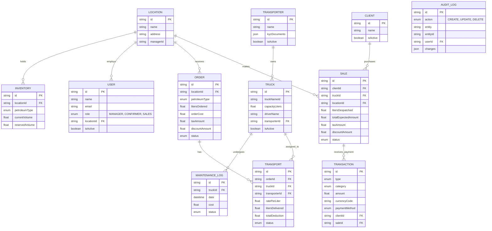

# Database Schema: Logistics & Fleet Management System (Future-Proofed)

This document outlines the database schema designed to support all the modules and requirements defined in the Logistics & Fleet Management System PRD. This version includes additions for scale, such as Audit Logging, Locations/Branches, Inventory Management, Maintenance Tracking, and Soft Deletes.

## 1. Entity-Relationship (ER) Diagram
Below is a high-level overview of how the different entities in the system connect to each other.



## 2. Prisma Schema Definition
Below is the technical schema representation using Prisma (a popular modern ORM), which precisely maps out tables, fields, data types, and relationships. It includes future-proof updates like soft-deletes (`deletedAt`, `isActive`) and Audit logs.

```prisma
// Prisma Schema for Logistics & Fleet Management System

generator client {
  provider = "prisma-client-js"
}

datasource db {
  provider = "postgresql"
  url      = env("DATABASE_URL")
}

model User {
  id         String    @id @default(uuid())
  name       String
  email      String    @unique
  role       Role
  locationId String?
  location   Location? @relation(fields: [locationId], references: [id])
  isActive   Boolean   @default(true)
  deletedAt  DateTime?
  createdAt  DateTime  @default(now())
  updatedAt  DateTime  @updatedAt
}

enum Role {
  TRANSPORT_MANAGER
  ORDER_CONFIRMER
  SALES_MANAGER
  ADMIN
}

model Location {
  id          String      @id @default(uuid())
  name        String
  address     String?
  managerId   String?
  users       User[]
  orders      Order[]
  sales       Sale[]
  inventories Inventory[]
  createdAt   DateTime    @default(now())
  updatedAt   DateTime    @updatedAt
}

model Inventory {
  id             String        @id @default(uuid())
  locationId     String
  location       Location      @relation(fields: [locationId], references: [id])
  petroleumType  PetroleumType
  currentVolume  Float         @default(0)
  reservedVolume Float         @default(0)
  lastUpdated    DateTime      @default(now()) @updatedAt
  
  @@unique([locationId, petroleumType])
}

model Transporter {
  id             String         @id @default(uuid())
  name           String
  kycDocuments   Json           // Array of document URLs
  trucks         Truck[]
  transports     Transport[]
  payments       Transaction[]  // Payments made to transporter
  isActive       Boolean        @default(true)
  deletedAt      DateTime?
  createdAt      DateTime       @default(now())
  updatedAt      DateTime       @updatedAt
}

model Truck {
  id              String            @id @default(uuid())
  transporterId   String
  transporter     Transporter       @relation(fields: [transporterId], references: [id])
  truckNameId     String
  capacityLiters  Float
  driverName      String
  driverPhone     String
  transports      Transport[]
  sales           Sale[]
  maintenanceLogs MaintenanceLog[]
  isActive        Boolean           @default(true)
  deletedAt       DateTime?
  createdAt       DateTime          @default(now())
  updatedAt       DateTime          @updatedAt
}

model MaintenanceLog {
  id             String         @id @default(uuid())
  truckId        String
  truck          Truck          @relation(fields: [truckId], references: [id])
  date           DateTime
  mechanicName   String?
  description    String
  cost           Float
  status         MaintenanceStatus @default(SCHEDULED)
  createdAt      DateTime       @default(now())
  updatedAt      DateTime       @updatedAt
}

enum MaintenanceStatus {
  SCHEDULED
  IN_PROGRESS
  COMPLETED
}

model Order {
  id             String         @id @default(uuid())
  locationId     String?        // Depot receiving the order
  location       Location?      @relation(fields: [locationId], references: [id])
  petroleumType  PetroleumType
  litersOrdered  Float
  
  // Financials
  orderCost      Float
  loadingCost    Float
  transportCost  Float
  taxAmount      Float?         @default(0)
  discountAmount Float?         @default(0)
  
  status         OrderStatus    @default(PENDING)
  transports     Transport[]    // 1-to-many: Multiple trucks per order
  payments       Transaction[]  // Order payments
  createdAt      DateTime       @default(now())
  updatedAt      DateTime       @updatedAt
}

enum PetroleumType {
  PMS
  AGO
  DPK
  KEROSENE
}

enum OrderStatus {
  PENDING
  CONFIRMED
  CHANGED
  CANCELLED
}

model Transport {
  id                  String               @id @default(uuid())
  orderId             String
  order               Order                @relation(fields: [orderId], references: [id])
  truckId             String
  truck               Truck                @relation(fields: [truckId], references: [id])
  transporterId       String
  transporter         Transporter          @relation(fields: [transporterId], references: [id])
  destination         String
  transportType       String
  ratePerLiter        Float
  litersCarried       Float
  status              TransportStatus      @default(IN_TRANSIT)
  
  // Completion Details
  litersDelivered     Float?
  firstDeliveryLoc    String?
  subsequentLocs      Json?                // Array of { location: string, feePerLiter: float }
  
  // Financials & Deductions (Tab A & B)
  baseRate            Float?
  depositsMade        Float?               // Can be cash or petroleum equivalent
  expensesDeductions  Float?
  netTransportFeePaid Float?
  maintenanceCost     Float?               // Cost related to trip, separate from MaintenanceLog
  litersLost          Float?
  litersAmount        Float?               // Amount for litres lost
  volumeEquivalent    Float?
  totalDeduction      Float?
  
  createdAt           DateTime             @default(now())
  updatedAt           DateTime             @updatedAt
}

enum TransportStatus {
  IN_TRANSIT
  COMPLETED
}

model Client {
  id             String         @id @default(uuid())
  name           String
  sales          Sale[]
  payments       Transaction[]  // Payments received from client
  isActive       Boolean        @default(true)
  deletedAt      DateTime?
  createdAt      DateTime       @default(now())
  updatedAt      DateTime       @updatedAt
}

model Sale {
  id                  String         @id @default(uuid())
  clientId            String
  client              Client         @relation(fields: [clientId], references: [id])
  truckId             String
  truck               Truck          @relation(fields: [truckId], references: [id])
  locationId          String?        // Branch/Depot making the sale
  location            Location?      @relation(fields: [locationId], references: [id])
  
  litersDespatched    Float
  litersReceived      Float
  
  // Financials
  amountPerLiter      Float
  taxAmount           Float?         @default(0)
  discountAmount      Float?         @default(0)
  paymentReceived     Float          // Payment received by client
  totalExpectedAmount Float
  
  status              SaleStatus     @default(UNPAID)
  transactions        Transaction[]  // Linked inflows
  createdAt           DateTime       @default(now())
  updatedAt           DateTime       @updatedAt
}

enum SaleStatus {
  UNPAID
  PART_PAID
  CLEARED
}

model Transaction {
  id               String            @id @default(uuid())
  type             TransactionType
  category         TransactionCategory
  amount           Float
  currencyCode     String            @default("NGN")
  paymentMethod    PaymentMethod?
  paymentPurpose   PaymentPurpose?
  date             DateTime
  reference        String?           // Bank teller / transfer ID
  proofUrl         String?           // Receipt upload
  
  // Optional Foreign Keys based on category
  clientId         String?
  client           Client?           @relation(fields: [clientId], references: [id])
  saleId           String?
  sale             Sale?             @relation(fields: [saleId], references: [id])
  transporterId    String?
  transporter      Transporter?      @relation(fields: [transporterId], references: [id])
  orderId          String?
  order            Order?            @relation(fields: [orderId], references: [id])
  
  createdAt        DateTime          @default(now())
  updatedAt        DateTime          @updatedAt
}

enum TransactionType {
  INFLOW
  OUTFLOW
}

enum TransactionCategory {
  TRANSPORT_PAYMENT
  ORDER_PAYMENT
  PERSONAL_EXPENSE
  FLEET_EXPENSE
  CLIENT_PAYMENT
}

enum PaymentMethod {
  BANK_TRANSFER
  CASH
  CHEQUE
}

enum PaymentPurpose {
  ADVANCE_DEPOSIT
  PART_PAYMENT
  FULL_SETTLEMENT
  DEBT_CLEARANCE
}

model AuditLog {
  id          String      @id @default(uuid())
  action      AuditAction
  entity      String      // e.g. "Order", "Sale"
  entityId    String
  userId      String?     // The user who made the change
  changes     Json        // JSON representing before/after
  createdAt   DateTime    @default(now())
}

enum AuditAction {
  CREATE
  UPDATE
  DELETE
}
```
